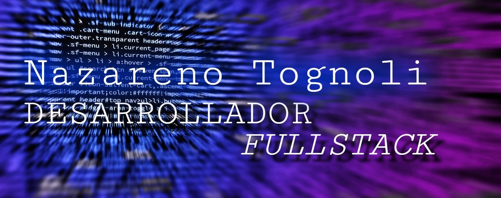

# Hello, I am Nazareno Tognoli 👋
</img>
## About me:
- I am currently working on self-directed projects, with some of them being publicly available in my repositories. I aim to showcase my skills and experience through these projects.
- I'm constantly learning new things and working hard to improve a broad range of skills
- I am deeply committed to enhancing my skills both as a programmer and as an individual, encompassing a diverse range of knowledge beyond just software development.
## My technology stack, for those interested, includes:
- HTML, CSS, Javascript
- Node and Express
- SQL / MySQL / ORM Sequelize
- React
- Webpack and its common dependencies
